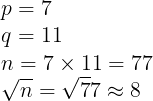

# babyrsa
Description:
> RSA for babies!

Attachment:
- [chal.py](chal.py)

We are given a Python script, which generate a RSA key and encrypt the `flag.txt`:
```py
#!/usr/bin/env python3
from Crypto.Util.number import *
from gmpy2 import next_prime

flag = open("flag.txt","rb").read().strip()
p = getStrongPrime(1024)
q = next_prime(p)
n = p * q
e = 0x10001
m = bytes_to_long(flag)
c = pow(m,e,n)

print(f"n = {n}")
print(f"e = {e}")
print(f"c = {c}")
```
We only have the public key (n,e) and ciphertext (c):
```py
n = 22306351450360835278685008577095637579379519735569993605372382025943065943172195653447501298828968514687284277198607097065634258314264314927371277442275519637994628244973451713428529246432421492448316055762649494875064883616150678248746788780631659395141126436598713108296958809877050508719429858288542409206141714853617337747692468415137300472541599402472407915882162354129011035959781898989018189851240885134793158675541708464792531211982651421335486888814185904694334748742140907479724360382947060649121854484350812707303750753924042963642230136006371631037322400368914718351407008699556959068979201259584736419897
e = 65537
c = 17602993744775645244932047693736399644507438713421090470524415766527158933476062715547401853988887892859852712288174327133373629909097820395435401533676533608936213580668532621040243037931761022394679651927262885744960614529599325651735809067636612587147031269202667870888506169666258327004309669721112194725267847462929621419423182917279393538900064854853776147192666718145232846523208281394755265917943312113266402772744899076664734081819237068101883336427745375537437389752990601021671228882409327526733171270971339644452600369079961452292583316600829728068432427992039322905022470729764699358872105298576585603770
```
The vulnerability is how the public key was generate:
```py
p = getStrongPrime(1024)
q = next_prime(p) # Get the nearest prime next to p
n = p * q
```
That means **p and q next to each other!**

We can just take the **nearest square root of `n` and find the p and q** (if we found p and q, we can calcualte the private key)

For example:



Square root n is approximately 8, find the prime next to 8 then we found the q!

After finding `q` we can calcualte `p` as well (n divide by q = p)

I solved it in a [Python script](solve.py):
```py
sqrt_n = int(gmpy2.sqrt(n))
q = gmpy2.next_prime(sqrt_n)
p = n // q
assert n == p*q

phi = (p-1)*(q-1)
d = inverse(e,phi)
m = pow(c,d,n)
print(long_to_bytes(m))
```
Result:
```
wgmy{20e6852af817ca67678df52a1668186c}
```

Simple RSA challenge!

## Flag
> wgmy{20e6852af817ca67678df52a1668186c}

## Alternative solution
Alternatively, you can use this [awesome integer factorization website](https://www.alpertron.com.ar/ECM.HTM) to factorize n to find p and q!